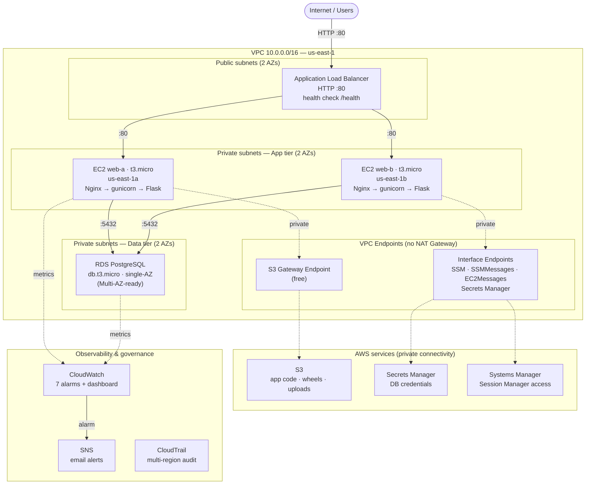

# Architecture Diagrams

This folder holds the architecture diagram for CloudOps Finance. The diagram
below reflects the **implemented** architecture (not planned/roadmap
components). It is written in Mermaid, which GitHub renders natively, so it
stays versionable as text and never breaks as an image link.

> Planned components (Route 53, CloudFront, WAF, Lambda, HTTPS/ACM) are
> intentionally **not** shown here — see `docs/architecture.md` for the
> implemented-vs-planned breakdown.

---

## Implemented architecture (multi-AZ, 3-tier)

---

## Request flow — what happens when a user opens the app

This is the path a single request takes through the diagram above, top to bottom.

1. **User → ALB.** A user opens the application URL (the ALB's public DNS name).
   The request hits the **Application Load Balancer** in the public subnets over
   HTTP on port 80. The ALB is the only internet-facing component; nothing else
   has a public address.

2. **ALB health check.** Before routing, the ALB only forwards to instances that
   pass its health check against `/health` — a lightweight endpoint that does
   **not** touch the database. This means a database problem will not make a
   healthy web process look "down" and pull the whole service offline.

3. **ALB → EC2 (load balanced across AZs).** The ALB forwards the request on
   port 80 to one of the two **EC2 instances** in the private subnets — `web-a`
   in us-east-1a or `web-b` in us-east-1b. Spreading across two Availability
   Zones is what gives the app high availability: if one AZ fails, the other
   keeps serving.

4. **Inside the instance: Nginx → gunicorn → Flask.** On the chosen instance,
   **Nginx** (port 80) receives the request and proxies it to **gunicorn**
   (port 5000), which runs the **Flask** application. Nginx handles buffering
   and static files; gunicorn runs the Python workers.

5. **App → Secrets Manager (first DB call).** To talk to the database, the app
   needs credentials. It reads them from **Secrets Manager** at runtime — never
   from code or a config file. That call travels over the **Secrets Manager
   Interface VPC Endpoint** (private DNS), so it never leaves AWS's private
   network. (This endpoint was the fix for the request that used to hang for
   30s — see `docs/lessons-learned.md`, Phase 3.)

6. **App → RDS (the query).** With the credentials, the app connects to **RDS
   PostgreSQL** on port 5432 — reachable only from the web tier, because the
   database Security Group accepts traffic exclusively from the web Security
   Group. The app reads/writes finance entries and computes the balance.

7. **Response → user.** Flask renders the page (balance + recent entries),
   gunicorn returns it to Nginx, Nginx returns it to the ALB, and the ALB
   returns it to the user.

8. **In parallel: observability.** Throughout, **CloudWatch** collects metrics
   from EC2 and RDS. If a metric crosses a threshold (e.g. RDS CPU > 80%, or an
   EC2 status check fails), the matching alarm fires and **SNS** sends an email.
   **CloudTrail** records every administrative action across all regions.

> **Note:** the connection is HTTP, not HTTPS — the browser shows "Not secure".
> TLS via ACM/CloudFront is on the roadmap (`docs/security.md`).

---

## Build flow — the order the architecture was provisioned

This is how the environment is built from nothing to serving traffic. Each step
depends on the ones before it.

1. **Foundation (Phase 1).** Harden the account: MFA on root, a dedicated IAM
   user, multi-region CloudTrail, and AWS Budgets — before creating anything
   that can cost money.

2. **Networking (Phase 2).** Create the **VPC** (10.0.0.0/16), then four
   **subnets** across two AZs (2 public, 2 private), the **Internet Gateway**,
   the **route tables** (public → IGW, private → local), and the three layered
   **Security Groups** (ALB → Web → DB).

3. **IAM role + storage + data (Phase 3A).** Create the EC2 **IAM role** (SSM +
   S3 read + Secrets Manager), the **S3 buckets**, the **RDS PostgreSQL**
   instance in the private subnets, and store the DB credentials in **Secrets
   Manager**.

4. **VPC Endpoints.** Because there is no NAT Gateway, add the **S3 Gateway
   Endpoint** (free) and the **Interface Endpoints** (SSM, SSMMessages,
   EC2Messages, Secrets Manager, with Private DNS). Without these, the private
   instances cannot reach AWS services at all.

5. **Build the deployment artifacts.** Pre-build the Python **wheels** in a
   `python:3.9-slim` Docker container (matching the EC2 runtime) and upload them
   to S3, alongside the application code. This is what lets the instances
   install dependencies **offline**, since the private subnet cannot reach PyPI.

6. **Launch Template + instances.** Create the versioned **Launch Template**
   (Amazon Linux 2023, t3.micro, IMDSv2 required, no key pair, SSM-only) whose
   user-data is the **zero-touch bootstrap script**. Launching from it brings an
   instance from boot to serving traffic in under a minute. Launch **two**
   instances, one per AZ.

7. **Initialize the database once.** Run the schema migration (`db-init.sql`)
   a single time against RDS — not from the bootstrap, because the seed insert
   is not idempotent and would duplicate across two instances.

8. **Load balancer (Phase 3B).** Create the **ALB** and the **Target Group**
   (health check `/health`) and register the two instances. Confirm both targets
   are healthy and the app is reachable from the internet.

9. **Observability (Phase 4).** Create the **SNS** topic and confirm the email
   subscription, then the seven **CloudWatch alarms** and the **dashboard**.
   Test the alarm-to-email path end-to-end (not just configure it).

10. **Teardown when idle.** Delete the billable components (ALB, Interface
    Endpoints) and stop EC2/RDS between sessions. The rest is free and persists.
    See `docs/demo-teardown-checklist.md`.

---

## How to update this diagram

Edit the Mermaid block above directly in `README.md` — GitHub re-renders it on
save. No external tool, no image export. If a PNG/SVG export is needed later
(for a slide deck, for example), the Mermaid source can be exported from the
[Mermaid Live Editor](https://mermaid.live).

## Legend

- **Solid arrows** = request/data path (user → ALB → EC2 → RDS)
- **Dotted arrows** = private connectivity to AWS services via VPC Endpoints,
  and metric/alarm flow
- **No NAT Gateway** — private instances reach AWS services through VPC
  Endpoints only