# Screenshots

Visual evidence of the implemented architecture, in chronological build order.
Every image is committed to this folder and referenced by relative path, so the
links never expire.

> Images are uploaded as files (Add file → Upload files), not pasted into the
> editor. Pasted images use temporary signed URLs that expire within minutes.

---

## Phase 2 — Networking

### VPC (10.0.0.0/16)
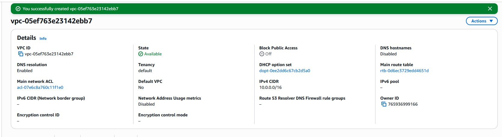

### Four subnets across two AZs (2 public + 2 private)
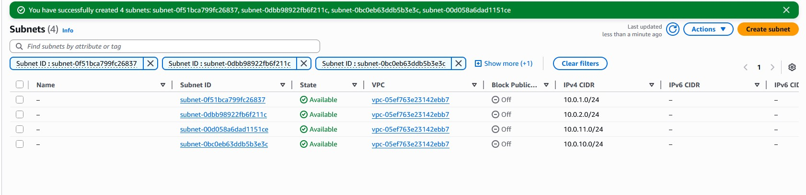

### Internet Gateway attached
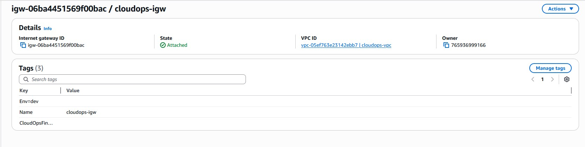

### Route tables (public + private)
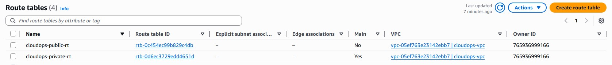

### Private subnet associations
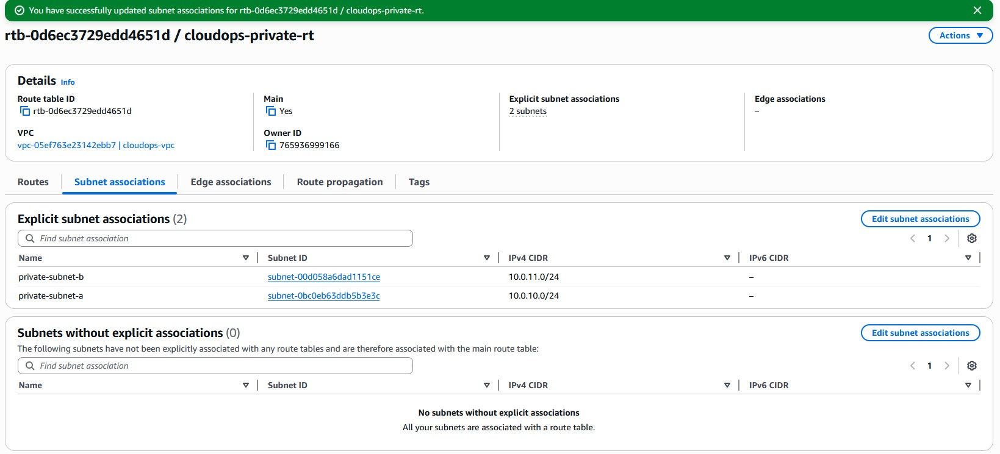

### Public subnet associations
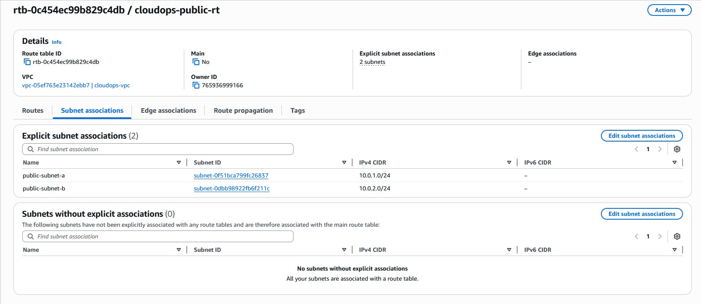

### Security Group — ALB tier (HTTP/HTTPS from internet)
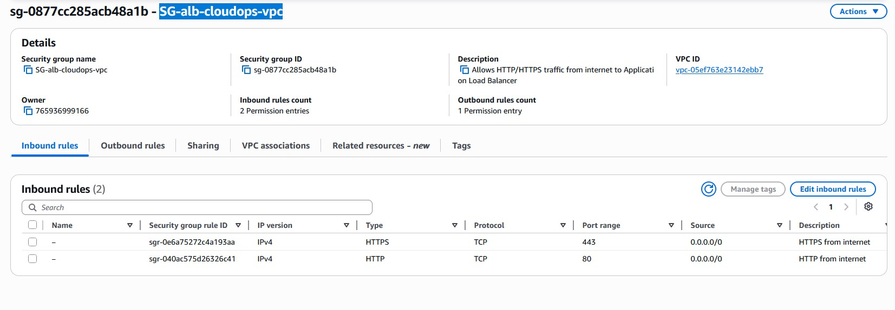

### Security Group — Database tier (PostgreSQL from web tier only)
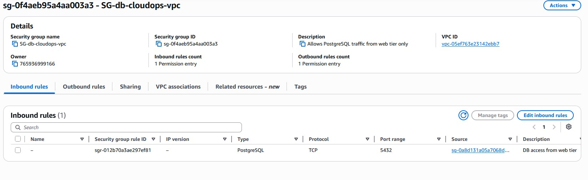

---

## Phase 3 — Compute, Data & Deployment

### IAM role for EC2 (SSM + S3 read + Secrets Manager)
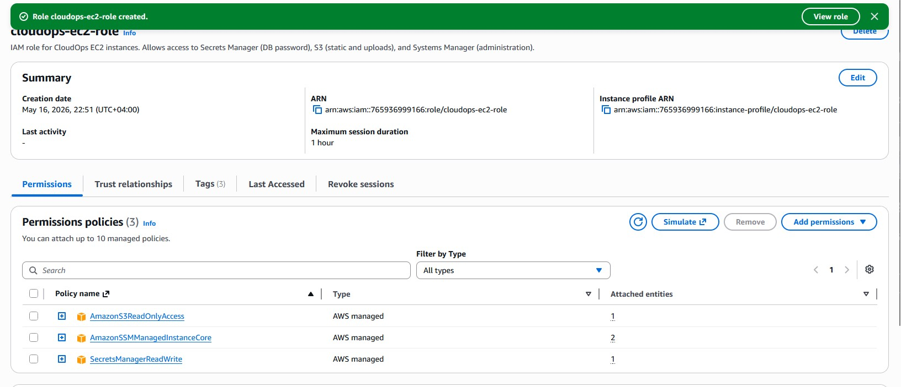

### S3 buckets (static, uploads, CloudTrail logs)
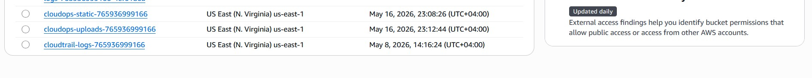

### RDS PostgreSQL (db.t3.micro, private)
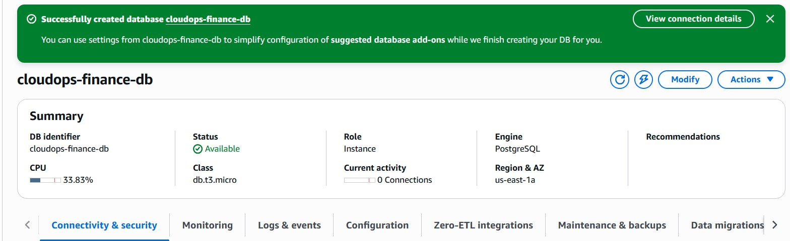

### Secrets Manager — database credentials
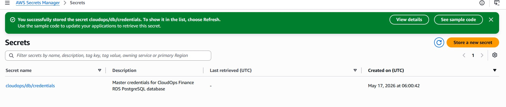

### VPC Endpoints (S3 Gateway + SSM/SSMMessages/EC2Messages Interface)
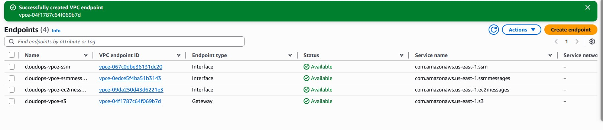

### Launch Template created
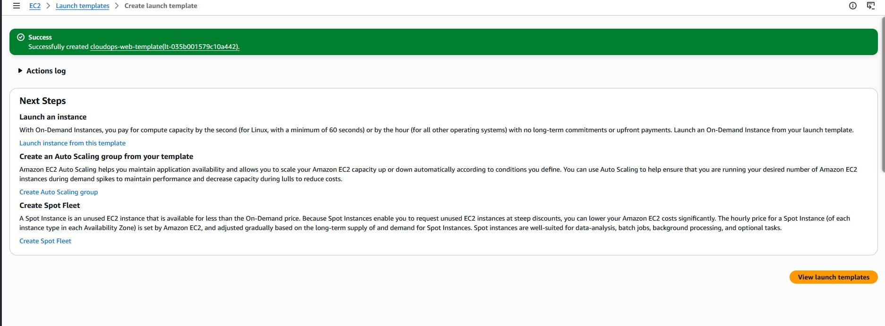

### Launch Template details (t3.micro, AL2023, private subnet, SSM)
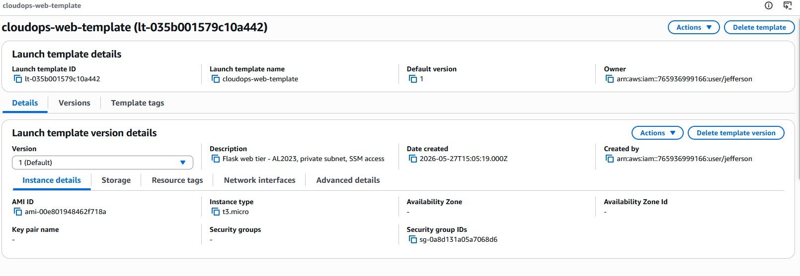

### Launch Template versions (v1 → v2 → v3, immutable rollback)
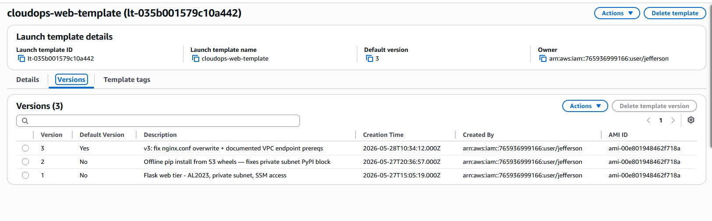

### Launch Template v3 set as default
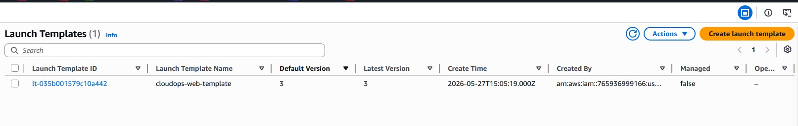

### Two instances running across two AZs
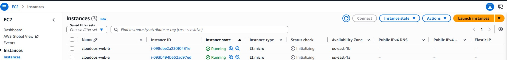

### Instances passing 3/3 status checks
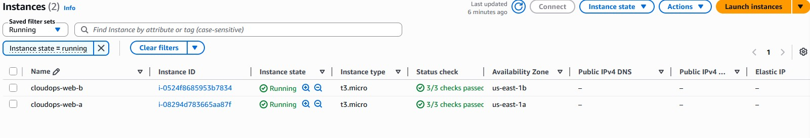

### SSM Session Manager — shell access with no SSH
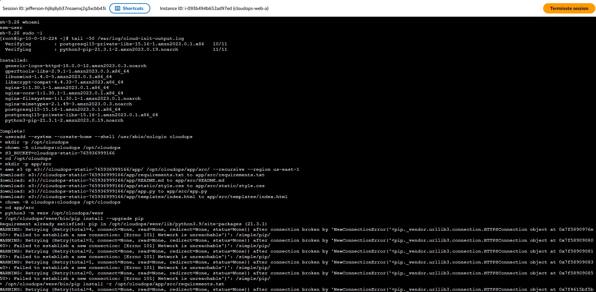

### cloud-init log — the offline-pip problem (PyPI unreachable from private subnet)

### cloud-init log — bootstrap complete in ~52s (nginx OK, services started)

### Target Group (cloudops-tg-web)

### Target Group — 2 healthy targets, one per AZ

### Application Load Balancer — active

### ALB resource map — listener → rule → target group → 2 healthy targets

### Application live through the ALB (public URL, HTTP)

> Note: the browser shows "Not secure" — the listener is HTTP only. HTTPS via
> ACM/CloudFront is on the roadmap (see `docs/security.md`).

---

## Phase 4 — Observability

### Seven CloudWatch alarms in OK state (verified via CloudShell)

### CloudWatch dashboard — CloudOpsFinance (EC2, RDS, alarm status)

---

## Teardown

### Teardown verified via CLI (EC2 stopped, RDS stopped, Interface endpoints removed)

---

## Coverage notes

- **Phase 1 (Foundation)** — no screenshots included yet (CloudTrail, Budgets,
  IAM hardening). Documented in `docs/security.md` and `docs/lessons-learned.md`.
- **SNS topic** — the alarm-to-email notification topic (Standard) is not shown
  here; the alarm configuration and OK states are evidenced above. The end-to-end
  email test is documented in `docs/lessons-learned.md` (Phase 4).
- **Security Group — Web tier** — not shown here. SSH (port 22) was removed so
  that access is SSM-only; the remaining HTTP-from-ALB rule is reflected in the
  ALB and target-group evidence above.
